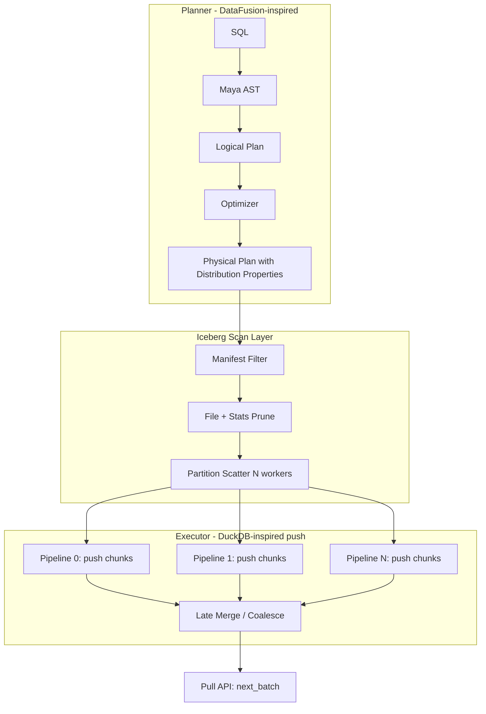

# Maya Query Engine Architecture

Design reference for Maya's streaming query engine on Apache Iceberg at scale. Informed by DuckDB (push execution), DataFusion (planning/optimizer), Polars (morsel parallelism), and Snowflake (partition pruning + pipelined DAG execution).

---

## Goals

- Execute SQL/analytics queries over **very large Iceberg tables**
- Most queries have joins and window functions keyed on **partition-aligned columns**
- **Partition-scattered, parallel push pipelines** as the primary execution strategy
- Bounded memory via partition-local execution; explicit spill when needed
- Zig-native implementation building on existing parquet reader, columnar frame, and `std.Io` concurrency

---

## Core Insight: Partition-Aligned Execution

If joins and window functions are keyed on columns that align with how data is physically organized, we can run **mostly independent pipelines per partition** and avoid expensive global shuffles.

### Three layers of alignment

| Layer | What it does | Iceberg mechanism |
|---|---|---|
| **Plan-time pruning** | Skip files/manifests | Manifest filtering, partition spec, column stats |
| **Scan-time co-location** | Each worker reads only its partition's files | `partition=` in manifest entries, bucket transforms |
| **Execution-time locality** | Join/window/agg stay partition-local | No repartition exchange needed |

### Important refinement

**Hash-partitioning the execution plan is not the same as Iceberg being partitioned on that column.**

1. **Prefer Iceberg's native partition spec** when join/window keys match (identity, year/month/day/hour, bucket transforms)
2. **Only hash-repartition at execution time** when tables are partitioned differently or one side isn't partitioned
3. Treat **co-partitioned join** as an optimizer rule: if `A.partition_key ≡ B.partition_key` and both scans are aligned, elide the exchange entirely

### Window functions

If `PARTITION BY` matches the physical partition key, each pipeline computes windows **locally** with bounded state (often one sorted run per partition, or O(1) state for running aggregates).

---

## Reference: Snowflake-Style Execution

Snowflake uses **push-based, vectorized, pipelined DAG execution** — operators push batches downstream as fast as consumers accept them. Output rows can appear while scans are still active.

They still have blocking operators; they're just **rare in pruned, partition-local plans**:

| Streaming (non-blocking) | Blocking (pipeline breakers) |
|---|---|
| Filter, project | Global sort |
| Many aggregations after partition-local partial agg | Global distinct |
| Hash join when build side fits or is partition-local | Cross-partition hash join build |
| | Some window patterns |

Snowflake minimizes blockers through:

- Aggressive **micro-partition pruning** (static + runtime/dynamic pruning from build-side stats)
- **Co-located plan fragments** — pieces that don't exchange data until a late merge
- **Push flow control** with backpressure instead of deep recursive pull

**Target for Maya:** not zero blocking operators, but optimized plans that are almost entirely partition-local pipelines with a late merge.

---

## Recommended Architecture

Hybrid of **DataFusion-style planning** + **DuckDB-style push execution**, with partition-first planning as the differentiator.

### High-level flow

```
SQL → Maya AST → LogicalPlan → Optimizer → PhysicalPlan → Execute
```

Physical plan nodes should carry **distribution properties**:

- `PartitionedOn(keys, num_partitions)`
- `SortedOn(keys, order)`
- `SinglePartition` (needs merge)

High-value optimizer rules for Iceberg:

- Manifest + file pruning pushdown
- **Partition alignment detection** for joins
- Window → local window when `PARTITION BY` ⊆ physical partition key
- Insert exchange/repartition **only when properties don't match**

### Execution: DuckDB-style push, partition-local pipelines

**Per-partition pipeline model:**

```
For each partition p in [0..N):
  spawn pipeline task(p):
    source_p → op1 → op2 → ... → sink_p   // push chunks through
  merge sinks at end (if needed)
```

Each task runs a tight push loop (DuckDB `PipelineExecutor` pattern): fetch a chunk from source, push through operators.

**Why push over pull for Maya:**

- `std.Io.Group` maps naturally to one concurrent task per pipeline
- Partition-local execution = many independent push pipelines
- Better cache locality when scan → filter → join probe stay on the same core
- Matches Snowflake's model more closely than Volcano pull

**Keep a pull API at the boundary:** expose `next_batch()` to clients, but implement it as a thin wrapper over a result sink queue fed by push pipelines.

### Partition-scattered sources (core physical optimization)

```
PhysicalPartitionScatter {
  partition_key: [col_a, col_b],
  num_partitions: N,
  children: [scan_a, scan_b],
}
```

Each child scan gets a **partition constraint** pushed into the Iceberg scan. Workers read only their file subset from manifests.

**When this eliminates blocking:**

- Hash join → partition-local hash join
- Group by on partition key → partial agg per pipeline
- Window on partition key → local window per pipeline

**When you still need a merge phase:**

- Global `ORDER BY` without partition prefix
- `COUNT(DISTINCT)` on non-partition columns
- Final aggregation across partition partial results

Design the merge as an explicit late stage, not hidden inside operators.

### What not to start with

- Full Polars-style hybrid async graph — too complex for MVP
- Pure Volcano pull internally — fights partition-local push goals
- Global hash repartition as default — make it the fallback

---

## MVP Architecture



**Batch unit:** fixed-size columnar chunks (2048–8192 rows), like DuckDB `DataChunk` / Arrow `RecordBatch`.

**Operator interface (push):**

- `Source::next_chunk(out)`
- `Operator::execute(in, out)`
- `Sink::consume(in)` + `finalize()`

**Thread model:** one push pipeline per partition per query phase; `std.Io.Group.concurrent` schedules pipeline tasks.

---

## SQL Frontend

PostgreSQL-compatible SQL via **libpg_query** (PostgreSQL 18 parser, vendored at `vendor/libpg_query`).

```
SQL string
  → pg_query_parse()           // JSON parse tree (Postgres node types)
  → Maya AST (sql/ast/)        // our IR: Expr, Select, Join, Window, ...
  → LogicalPlan                // planner input
```

Current state: `src/sql/pg_query.zig` wraps parse; AST transform and binder are next.

Key Postgres JSON node types for expressions:

| Postgres node | Maya AST |
|---|---|
| `ColumnRef` | column reference |
| `A_Const` | literal |
| `OpExpr` | binary/unary op |
| `FuncCall` | function call |
| `SubLink` | subquery |

---

## Repository Layout

```
maya-zig/
  build.zig              # maya lib + libpg_query + tests
  build/libpg_query.zig  # compiles vendor C sources
  vendor/libpg_query/    # submodule (18-latest)
  src/
    root.zig             # library root
    main.zig             # CLI
    tests.zig            # integration tests
    core/                # frame, series, expr, bitmap
    io/parquet/          # parquet reader (today's scan layer)
    sql/
      pg_query.zig       # libpg_query wrapper
      ast/               # Maya AST (planned)
      transform/         # pg JSON → Maya AST (planned)
    util/                # helpers, thrift (parquet metadata), varint
  docs/
```

---

## Spilling

Compute buffers are **not** transparently swapped to disk by the OS. Mature engines use **explicit, operator-aware spill** when memory limits are hit.

### Reference engines

**DataFusion:** operators register with a `MemoryPool`; on reservation failure they spill columnar batches to temp files (Arrow IPC). Hash agg/join/sort use partitioned multi-pass replay.

**DuckDB:** operator-level external algorithms (radix hash join, external sort) plus buffer pool / `TemporaryMemoryManager` for coordinated memory.

**Polars:** newer `polars-ooc` spill tokens — evolving, not the best production reference yet.

### Recommendation for Maya

| Strategy | Effect |
|---|---|
| Partition-scattered execution | Each pipeline sees 1/N of data |
| Iceberg file pruning | Less data enters operators |
| Partial agg per partition | Accumulators bounded by partition cardinality |
| Late merge | Only final combine needs global memory |

When spill is needed, use the DataFusion model:

1. Memory budget per query (optionally per pipeline)
2. Spill-capable operators register reservations
3. On pressure: partition operator state, write **columnar batch files** (Parquet or Arrow IPC)
4. Multi-pass replay in partition order

Spill **per pipeline independently** so skew in one partition does not kill others.

---

## First Milestones

1. **Iceberg scan** with manifest pruning + partition constraints — scatter file lists across workers
2. **Push pipeline executor** — source/operator/sink, `Io.Group` per pipeline, fixed chunk size
3. **Distribution properties** in physical plan — detect join/window keys matching Iceberg partition spec
4. **Partition-local hash join** — no exchange when aligned
5. **Memory budget + explicit spill** for hash join/agg
6. **Late merge operator** for cross-partition partial results
7. **SQL transform** — libpg_query JSON → Maya AST → logical plan

Skip a general exchange/repartition layer until a query genuinely needs cross-partition shuffle.

---

## Bottom Line

Partition-aligned joins and windows enable mostly parallel, partition-local push pipelines — the right core bet for Maya on Iceberg.

**Best setup:** DataFusion-like planning, DuckDB-like push execution, partition scatter as the primary physical optimization.

**On spilling:** operators explicitly write columnar batch files when memory reservations fail; partition-local execution is the first defense against needing spill at all.
